# VPyLab — VPython 호환 API 레퍼런스

VPyLab의 Python 측 API. `from vpython import *`로 모두 임포트 가능합니다.

> 본 문서는 VPyLab이 제공하는 객체와 함수의 공식 레퍼런스입니다. 표준 VPython과의 호환 범위와 차이점을 함께 표기합니다.

## 빠른 시작 — 14개 쇼케이스 예제

각 제목을 클릭하면 Sandbox에서 코드가 자동으로 로드됩니다 (`?example=<id>` URL 파라미터).

### 기본 (3D 객체 + 메서드)
| 미리보기 | 제목 | 핵심 기능 |
|---|---|---|
| 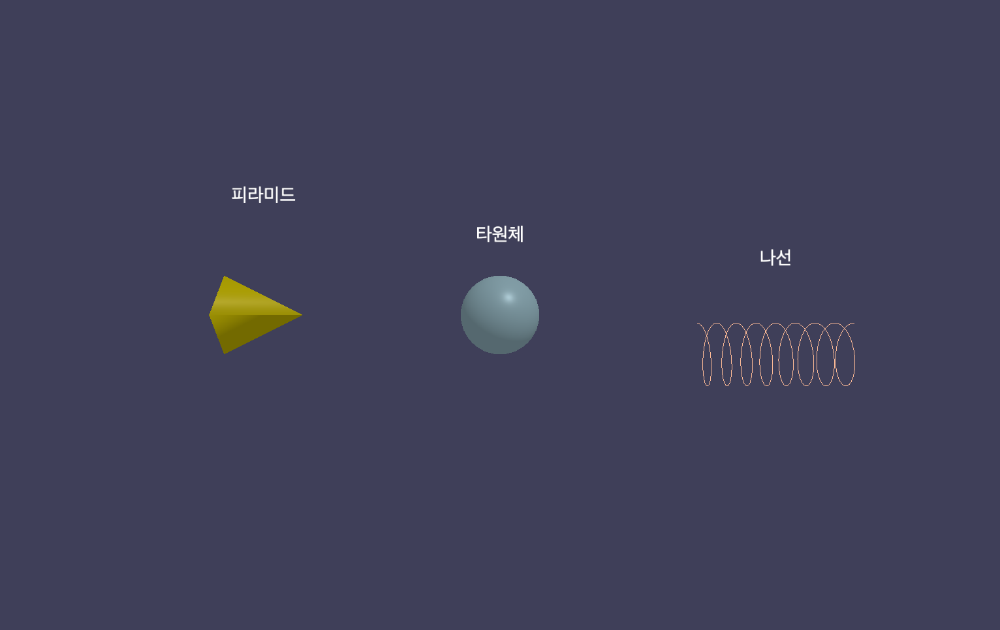 | [새 도형 모음](../client/src/data/examples.js) — `/sandbox?example=showcase-shapes` | pyramid, ellipsoid, helix, label |
| 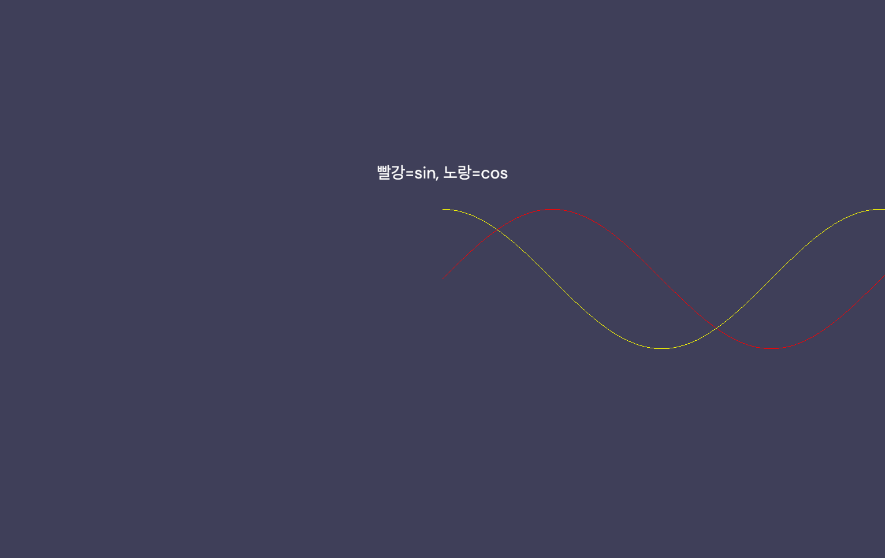 | [동적 곡선](../client/src/data/examples.js) — `/sandbox?example=showcase-curve` | curve.append() 누적 |
| 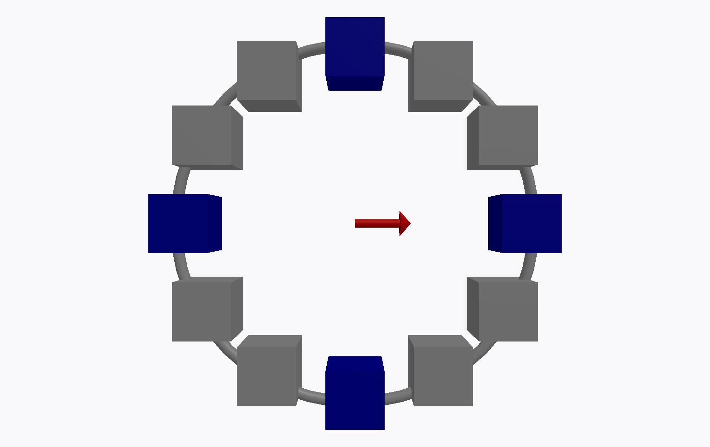 | [12지 시계](../client/src/data/examples.js) — `/sandbox?example=showcase-clone-rotate` | 객체 .clone(), vector.rotate() |

### 이벤트 + 위젯
| 미리보기 | 제목 | 핵심 기능 |
|---|---|---|
| 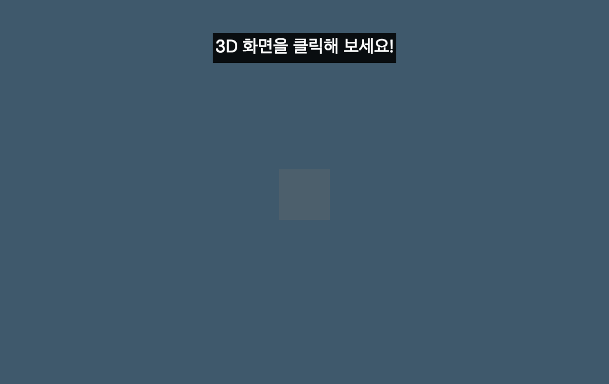 | [클릭으로 공 만들기](../client/src/data/examples.js) — `/sandbox?example=showcase-event-click` | scene.bind('click'), evt.pos |
| 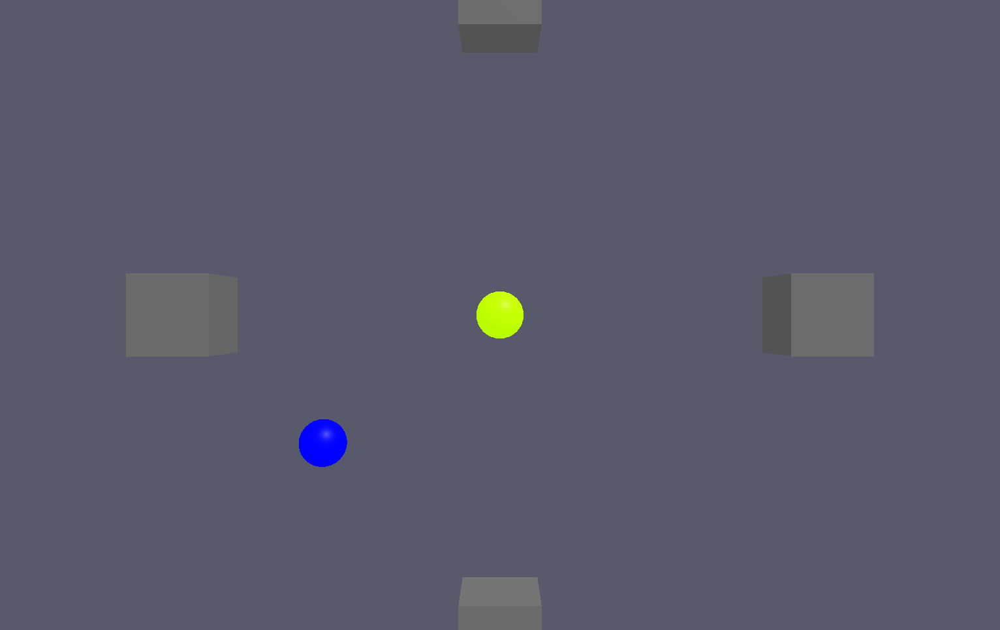 | [키보드로 공 조종](../client/src/data/examples.js) — `/sandbox?example=showcase-keyboard-bouncing` | scene.bind('keydown'), 벽 반사 |
| 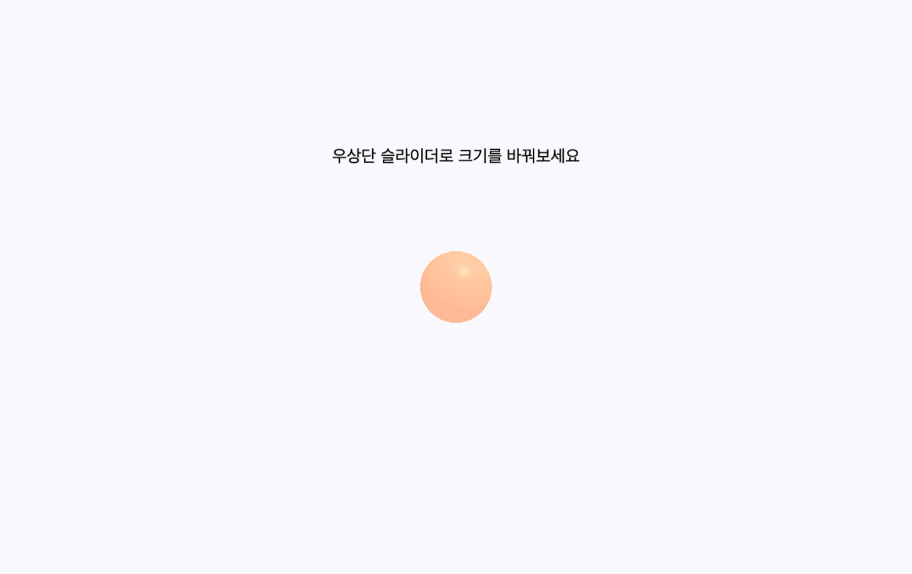 | [슬라이더로 공 크기 조절](../client/src/data/examples.js) — `/sandbox?example=showcase-slider-control` | slider, button 위젯 |

### 저수준 메시
| 미리보기 | 제목 | 핵심 기능 |
|---|---|---|
| 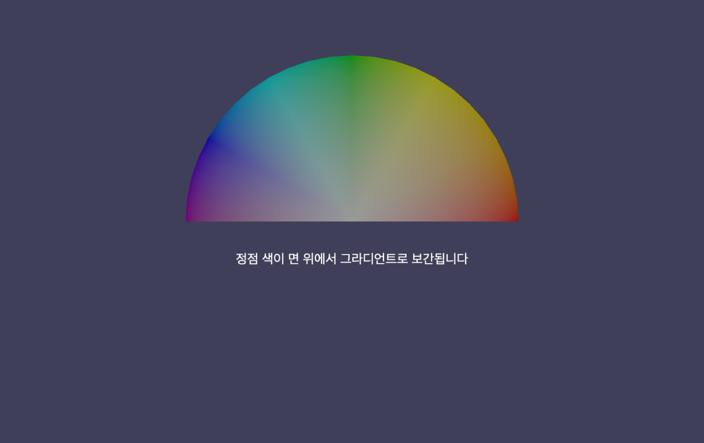 | [무지개 부채](../client/src/data/examples.js) — `/sandbox?example=showcase-vertex-rainbow` | vertex 정점 색상 그라디언트 |
| 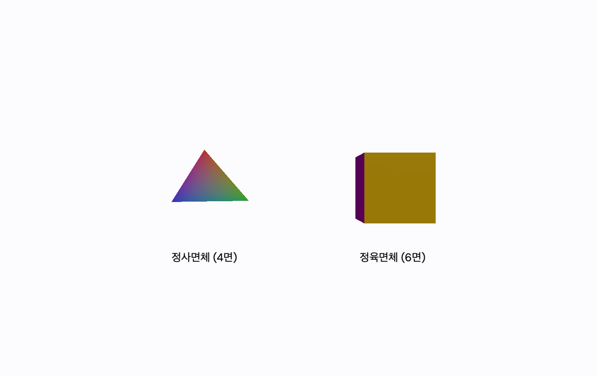 | [정사면체 + 정육면체](../client/src/data/examples.js) — `/sandbox?example=showcase-platonic-solids` | triangle, quad로 다면체 직접 구성 |
| 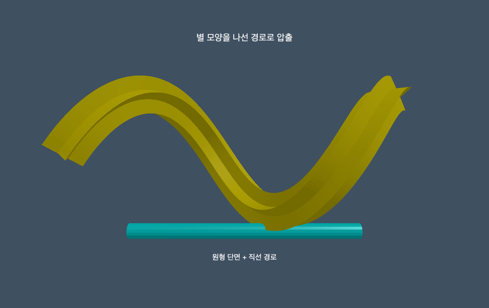 | [휘어진 튜브](../client/src/data/examples.js) — `/sandbox?example=showcase-extrusion-tube` | extrusion(path, shape) — 별 모양 압출 |

### 인터랙션 + 데이터
| 미리보기 | 제목 | 핵심 기능 |
|---|---|---|
| 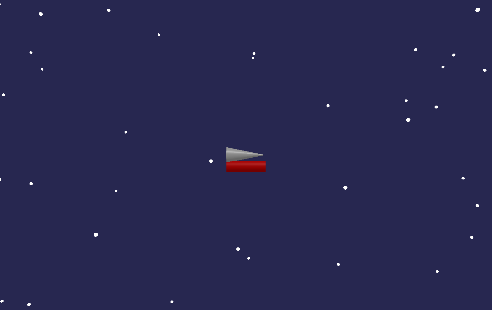 | [우주선 조종](../client/src/data/examples.js) — `/sandbox?example=showcase-keysdown-spaceship` | keysdown() 다중 키 동시 입력 |
| 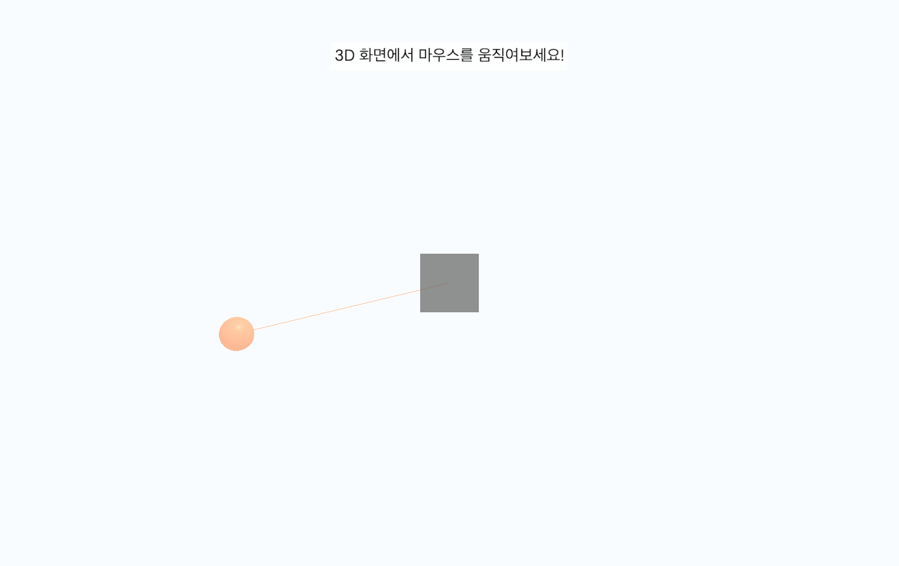 | [마우스 따라다니기](../client/src/data/examples.js) — `/sandbox?example=showcase-mouse-follow` | scene.mouse.pos 폴링 + 보간 |
| 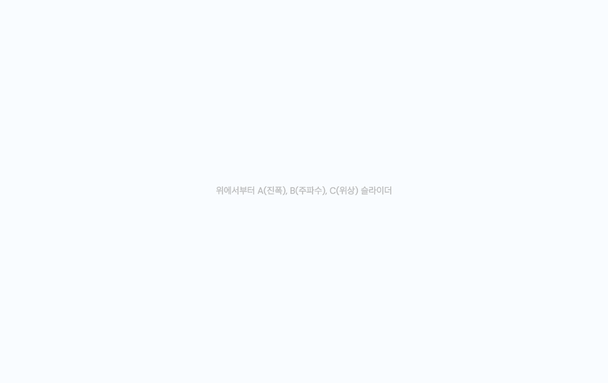 | [함수 그래프 조절](../client/src/data/examples.js) — `/sandbox?example=showcase-graph-functions` | slider 3개 + gcurve 실시간 갱신 |
| 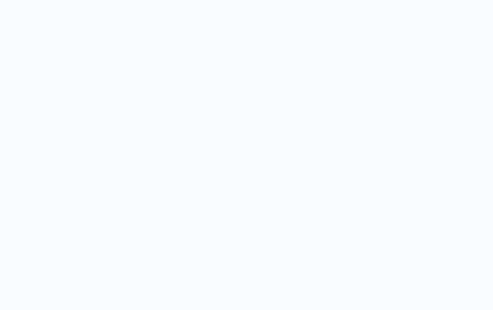 | [산점도 + 회귀선](../client/src/data/examples.js) — `/sandbox?example=showcase-scatter-regression` | gdots + gcurve, 최소제곱 회귀 |
| 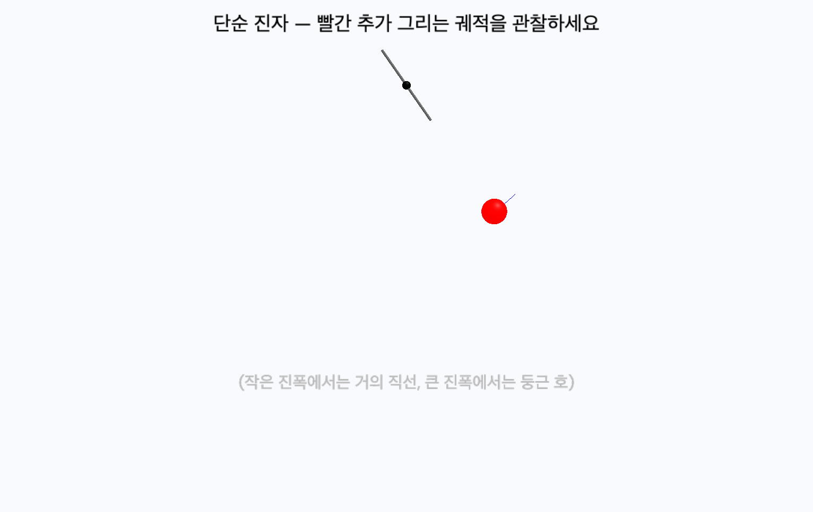 | [진자 운동 + 궤적](../client/src/data/examples.js) — `/sandbox?example=showcase-pendulum-trail` | attach_trail, Euler 적분 물리 |

> **링크 사용법**: 배포된 사이트에서 `https://your-domain/sandbox?example=showcase-shapes` 처럼 사용하면 해당 예제가 에디터에 자동으로 로드됩니다. 학생들에게 특정 예제를 직접 공유할 때 유용합니다.

---

---

## vector / vec

3D 벡터. `vector`와 `vec`은 동일합니다.

```python
v = vector(1, 2, 3)
v = vec(1, 2, 3)        # 별칭
v.x, v.y, v.z
v.mag                   # 크기
v.mag2                  # 크기 제곱
v.hat                   # 단위 벡터
v.to_list()             # [x, y, z]
v.clone()               # 복제

a + b, a - b, s * v, v / s, -v   # 산술 연산
a.dot(b)                          # 내적
a.cross(b)                        # 외적
a.proj(b)                         # b 방향으로 투영한 벡터
a.comp(b)                         # b 방향 스칼라 성분
a.diff_angle(b)                   # 두 벡터 사이 각(라디안)
a.rotate(angle, axis=...)         # axis 축으로 회전한 새 벡터
```

전역 함수: `mag(v)`, `mag2(v)`, `hat(v)`, `dot(a,b)`, `cross(a,b)`, `norm(v)`.

---

## color / 색상

30색 팔레트. 영문 속성과 한글 키 모두 지원합니다.

```python
color.red, color.green, color.blue, ...
색상['빨강'], 색상['초록'], 색상['파랑']
무지개[0]   # rainbow 팔레트
```

---

## 3D 객체

모든 객체는 공통 속성과 메서드를 가집니다.

### 공통 속성

```python
obj.pos       # vector
obj.color     # vector (RGB 0~1)
obj.visible   # bool
obj.opacity   # 0~1
obj.emissive  # bool — 자체 발광
```

axis가 있는 객체(`cylinder`, `arrow`, `cone`, `pyramid`, `helix`)는 `obj.axis`로 방향을 갖습니다.

### 공통 메서드

```python
obj.clone(**kwargs)
# 동일 속성으로 새 객체 생성. kwargs로 일부만 덮어쓰기.
ball2 = ball.clone(pos=vector(2, 0, 0))

obj.rotate(angle, axis=None, origin=None)
# origin 중심으로 axis 축으로 angle(라디안)만큼 회전.
# origin 미지정: 자기 위치(self.pos)
# axis 미지정: vector(0, 1, 0)
# axis 속성을 가진 객체는 그 방향도 함께 회전.

obj.attach_trail(color=None, retain=10000)
# 객체에 궤적을 부착. 이미 있으면 색/길이만 갱신.

obj.clear_trail()
# 누적된 궤적을 모두 지움.
```

### 프리미티브

| 클래스 | 주요 인자 | 설명 |
|---|---|---|
| `sphere` | `pos`, `radius`, `color`, ... | 구 |
| `box` | `pos`, `size=vector(L,H,W)`, `color`, ... | 직육면체 |
| `cylinder` | `pos`, `radius`, `axis`, `color`, ... | 원기둥 |
| `arrow` | `pos`, `axis`, `shaftwidth`, `color`, ... | 화살표(축+촉) |
| `cone` | `pos`, `radius`, `axis`, `color`, ... | 원뿔 |
| `ring` | `pos`, `radius`, `thickness`, `color`, ... | 도넛(토러스) |
| `pyramid` | `pos`, `size=vector(L,H,W)`, `axis`, ... | 사각뿔 |
| `ellipsoid` | `pos`, `size=vector(W,H,D)`, ... | 타원체 |
| `helix` | `pos`, `axis`, `radius`, `length`, `coils`, `thickness` | 나선/스프링 |
| `label` / `text` | `pos`, `text`, `color`, `height`, `background`, `border` | 항상 카메라를 향하는 텍스트 라벨 |
| `compound` / `frame` | `[obj, obj, ...]`, `pos`, `color`, ... | 여러 객체를 하나로 묶기 |

---

## 동적 곡선 / 점

### curve

3D 폴리라인. 점을 누적해 선을 그립니다.

```python
c = curve(color=color.red)
for i in range(100):
    c.append(vector(i*0.1, sin(i*0.1), 0))
c.clear()
```

### points

3D 점 집합.

```python
p = points(color=color.yellow, size=8)
for x in range(-5, 6):
    p.append(vector(x, 0, 0))
```

---

## 조명

```python
local_light(pos=vector(2,3,1), color=color.white, intensity=1.0)
distant_light(direction=vector(0,-1,0), color=color.white, intensity=0.8)
```

---

## scene 객체

씬 전역 제어.

```python
scene.background = color.black
scene.range = 5                      # 카메라 시야 반경 (MANUAL 모드 진입)
scene.center = vector(0, 0, 0)       # 카메라 타겟 중심
scene.autoscale = False              # True면 Auto-Fit 복귀
scene.title = "내 시뮬레이션"        # 콘솔에 출력 (DOM 오버레이는 미지원)
scene.caption = "설명..."            # 콘솔에 출력
```

> **참고**: `scene.range` / `scene.center`를 설정하면 자동 카메라(Auto-Fit/Follow)가 비활성화됩니다. `scene.autoscale = True` 또는 뷰 더블클릭으로 복귀할 수 있습니다.

전역 함수 `scene_background(color)`도 동일한 효과입니다.

---

## 시뮬레이션 제어

```python
await rate(60)        # 초당 60프레임. 코드 전처리기가 await를 자동 삽입
await sleep(0.5)      # 비동기 sleep
```

> 학생 코드의 `rate(...)` / `sleep(...)`은 자동으로 `await`가 붙도록 전처리됩니다.

---

## 사운드 / 음악

`play_sound`, `play_note`, `play_chord`, `play_sequence`, `play_sfx`, `start_bgm`, `stop_bgm`, `note`, `play_instrument`, 한글 별칭(`소리`, `음표`, `효과음`, `배경음악`, `배경음악정지`, `화음`, `악기`).

자세한 사용법은 [PROGRESS.md](../PROGRESS.md)의 사운드 섹션 참조.

---

## 차트 (3D 데이터 시각화)

`scatter3d`, `surface3d`, `line3d`, `bar3d` (한글: `산점도`, `표면그래프`, `선그래프`, `막대그래프`).

VPython의 `graph`/`gcurve` 시리즈와는 다른 자체 API입니다.

---

## 저수준 메시

### vertex / triangle / quad

`vertex`는 위치·색상을 가진 점. `triangle`/`quad`는 정점들로 면을 만듭니다.

```python
v0 = vertex(pos=vector(0, 0, 0), color=color.red)
v1 = vertex(pos=vector(1, 0, 0), color=color.green)
v2 = vertex(pos=vector(0, 1, 0), color=color.blue)
triangle(v0=v0, v1=v1, v2=v2)        # 그라디언트 삼각형

# quad는 4정점 (시계방향 권장)
quad(vs=[v0, v1, v2, vertex(pos=vector(1, 1, 0))])
```

### extrusion

2D 단면을 path를 따라 압출.

```python
# 별 모양을 곡선 path를 따라 스윕
shape = [(0, 0.5), (0.15, 0.15), (0.5, 0.15), (0.2, -0.05),
         (0.3, -0.5), (0, -0.2), (-0.3, -0.5), (-0.2, -0.05),
         (-0.5, 0.15), (-0.15, 0.15)]
path = [vector(t, 0, 0) for t in range(-3, 4)]
extrusion(path=path, shape=shape, color=color.gold)
```

---

## 이벤트 시스템

### scene.bind / scene.mouse

```python
def on_click(evt):
    # evt.pos: 월드 좌표 (vector)
    # evt.pick: 클릭된 객체 id 또는 None
    sphere(pos=evt.pos, radius=0.2, color=color.red)

def on_key(evt):
    # evt.key: 'ArrowUp', 'a', ' ' 등
    print(f"눌린 키: {evt.key}")

scene.bind('click', on_click)
scene.bind('keydown', on_key)
scene.bind('mousedown mouseup mousemove', on_click)  # 공백 구분 다중

# 데코레이터 형태도 지원
@scene.bind('mousemove')
def trace(evt):
    print(evt.pos)

# 이벤트 디스패치는 rate() 호출 시점에 발생 — 메인 루프 필수
while True:
    rate(30)
```

지원 이벤트: `click`, `mousedown`, `mouseup`, `mousemove`, `keydown`, `keyup`, `widget`(위젯 콜백).

`scene.mouse.pos` — 현재 마우스 위치(vector)를 폴링.
`scene.mouse.pick` — 현재 마우스 아래 객체 id 또는 `None`.

### keysdown() — 다중 키 동시 입력 폴링

`scene.bind('keydown')`은 한 번 누를 때 한 번 호출되지만, 게임처럼 여러 키를 **동시에** 누르고 싶을 때는 `keysdown()`을 사용합니다. 현재 눌려있는 키 리스트를 반환합니다.

```python
ball = sphere(pos=vector(0,0,0), radius=0.3, color=color.lime)
v = vector(0, 0, 0)
while True:
    rate(60)
    keys = keysdown()
    if 'ArrowLeft'  in keys: v.x -= 0.01
    if 'ArrowRight' in keys: v.x += 0.01
    if 'ArrowUp'    in keys: v.y += 0.01
    if 'ArrowDown'  in keys: v.y -= 0.01
    if ' '          in keys: v = vector(0, 0, 0)  # Space로 정지
    ball.pos += v
```

> standalone HTML export에서는 빈 리스트만 반환합니다 (Worker 채널 의존).

---

## UI 위젯

브라우저 우상단 패널에 DOM 컨트롤로 렌더링됩니다.

```python
# 슬라이더 — bind 콜백은 evt.value로 값 전달
def on_slide(evt):
    ball.radius = evt.value
slider(min=0.1, max=2.0, step=0.05, value=0.5, length=200, bind=on_slide)

# 버튼
def on_click(evt):
    print("눌림!")
button(text='시작', bind=on_click)

# 체크박스 / 라디오 / 메뉴 / 입력창
checkbox(text='궤적 표시', checked=True, bind=lambda e: print(e.value))
radio(text='빨강', name='c', value='red', checked=True, bind=lambda e: print(e.value))
menu(choices=['느림', '보통', '빠름'], selected='보통', bind=lambda e: print(e.value))
winput(prompt='속도', type='numeric', bind=lambda e: print(e.value))

# 모든 위젯은 .value로 현재값 읽기/쓰기 가능
# .disabled = True/False, .delete()로 제거
```

---

## 2D 그래프

```python
g = graph(title='속도 vs 시간', xtitle='t', ytitle='v',
          width=480, height=320)

# 4종 시리즈
v_curve = gcurve(graph=g, color=color.red, label='속도')
v_dots  = gdots(graph=g, color=color.blue, size=4)
bars_v  = gvbars(graph=g, color=color.green, width=0.5)

t = 0
while t < 10:
    rate(30)
    v = math.sin(t)
    v_curve.plot(t, v)
    v_dots.plot(t, v * 0.8)
    t += 0.1
```

---

## 표준 VPython과의 차이점

### 미지원 (현 시점)

- **카메라 직접 제어**: `scene.camera.pos`, `scene.forward`, `scene.up`
  → `scene.range` / `scene.center`로 부분 우회 가능
- **DOM 오버레이**: `scene.title` / `scene.caption`은 현재 콘솔 출력으로 대체

### standalone HTML export 시 주의

[utils/export-html.js](../client/src/utils/export-html.js)로 생성한 단일 HTML 파일에서는 다음이 동작하지 않습니다 (콘솔 경고 후 무시):

- UI 위젯 (`slider`, `button`, ...) — Worker 채널 의존
- 2D 그래프 (`graph`, `gcurve`, ...) — DOM 패널 의존
- 이벤트 (`scene.bind`, `scene.mouse`) — 양방향 채널 의존

3D 객체와 사운드는 export에서도 모두 동작합니다.

### VPyLab만의 추가 기능

- 한글 API: `색상`, `음표`, `무지개`, `음계`, `악기`, `산점도`, `표면그래프` 등
- 30색 팔레트: 한글/영어 키 양방향 접근
- 자동 카메라 시스템: Auto-Fit / Smooth Follow / Manual 3-모드
- 자체 차트 API: `scatter3d`, `surface3d`, `line3d`, `bar3d`

---

## 예제

### clone과 rotate

```python
from vpython import *
import math

# 원형으로 12개 박스 배치
unit = box(pos=vector(3, 0, 0), size=vector(0.5, 0.5, 0.5), color=color.cyan)
for i in range(1, 12):
    angle = i * math.pi / 6
    new_pos = vector(3, 0, 0).rotate(angle, axis=vector(0, 1, 0))
    unit.clone(pos=new_pos, color=color.red.rotate(angle, axis=vector(0,1,0)))
```

### curve로 사인파 그리기

```python
from vpython import *
import math

c = curve(color=color.yellow, radius=0.05)
for i in range(200):
    x = i * 0.05
    c.append(vector(x, math.sin(x*2), 0))
```

### helix 스프링

```python
from vpython import *
spring = helix(
    pos=vector(0, 0, 0),
    axis=vector(1, 0, 0),
    radius=0.5,
    length=4,
    coils=10,
    thickness=0.05,
    color=color.silver,
)
```

### scene.range로 고정 시야

```python
from vpython import *
scene.center = vector(0, 0, 0)
scene.range = 8
sphere(pos=vector(0,0,0), radius=1, color=color.red)
# Auto-Fit 비활성화 — 카메라가 고정됨
```

### 라벨

```python
from vpython import *
ball = sphere(pos=vector(0,0,0), radius=0.5, color=color.blue)
label(pos=vector(0, 1.2, 0), text="공", height=20, color=color.white,
      background=color.black, border=2)
```
